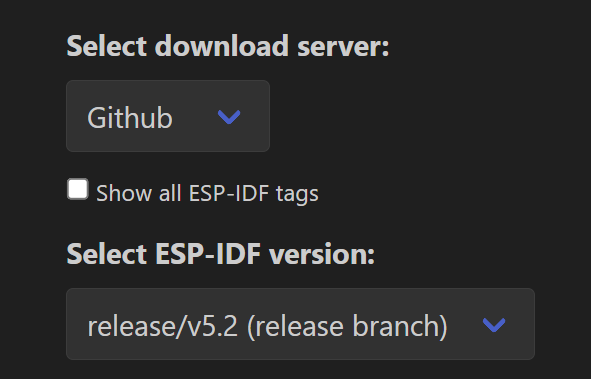

# Capyware Remote Control Firmware
### Hardware 
We are going to develop on the ESP32-S3. This chip provides all the functionality we primary need, and is honestly
probably a bit overkill. It comes with BLE, ADC, and GPIO pins.

### Firmware Overview
We're going to use the ESP-IDF (Espressif IoT Development Framework) for our main development platform.

### Setting up Dev Environment

1. Follow this install link [here](https://github.com/espressif/vscode-esp-idf-extension/blob/master/docs/tutorial/install.md). If you're on Mac/Linux, you will have prerequisite steps.
2. Make sure to do the optional step and Save Configuration Settings. Make sure to use the GitHub download server: .
3. This GitHub repo is the main project; there's no further steps you have to do to initialize it.
   

### Opening Menuconfig
Press `F1` and type `ESP-IDF: SDK Configuration editor (Menuconfig)`. This where you can modify a lot of your code.

### Adding Components
Many times, you might want to add ESP-IDF Components/Libraries. You can do so by pressing `F1` and typing `ESP-IDF: Show Component Registry` and installing the component you want. This adds to the `idf_component.yml` document in the `main` directory.

## Example folder contents

The project **sample_project** contains one source file in C language [main.c](main/main.c). The file is located in folder [main](main).

ESP-IDF projects are built using CMake. The project build configuration is contained in `CMakeLists.txt`
files that provide set of directives and instructions describing the project's source files and targets
(executable, library, or both). 

Below is short explanation of remaining files in the project folder.

```
├── CMakeLists.txt
├── main
│   ├── CMakeLists.txt
│   └── main.c
└── README.md                  This is the file you are currently reading
```
Additionally, the sample project contains Makefile and component.mk files, used for the legacy Make based build system. 
They are not used or needed when building with CMake and idf.py.
e.png).
   
